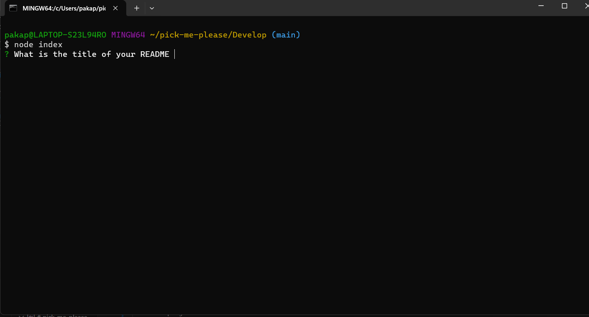
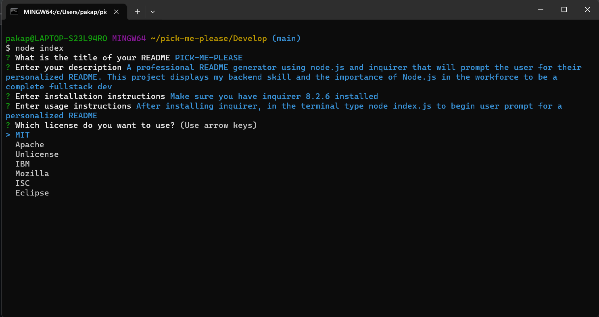

# pick-me-please

## Description

A professional README generator using node.js and inquirer that will prompt the user for their personalized README. This project displays my backend skill and the importance of Node.js in the workforce to be a complete fullstack dev
    
## Table of Contents

- [Installation](#installation)
- [Usage](#usage)
- [License](#license)
    
## Installation

Make sure you have inquirer 8.2.6 installed

## Usage
    
After installing inquirer, in the terminal type node index.js to begin user prompt for a personalized README  

Choose between a list of licenses

Overall view of prompts

Preview of generated README

Video link below
https://drive.google.com/file/d/1Gf-QyjeBWz3gbJUy08fHe4p1wXP5Ig6u/view
## License

    This project is licensed under the MIT license
